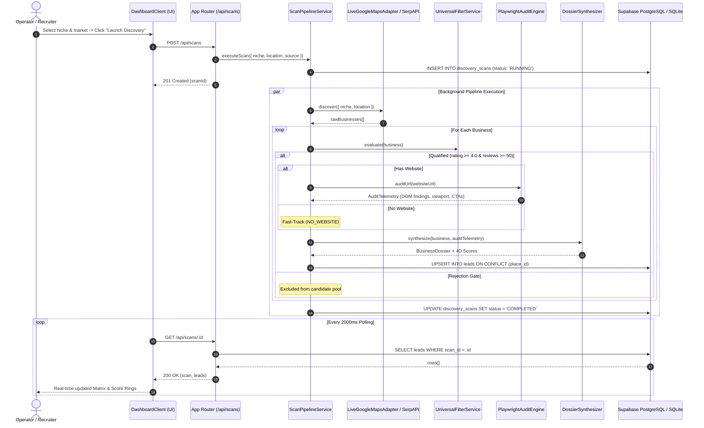

# ARCHITECTURE: Lead Engine (V1)
### Modular Feature-Driven (DDD) Subsystem Specifications

---

## 1. Directory & Subsystem Layout

```
src/
├── 🌐 app/                          # Next.js App Router (HTTP Controllers & Routing)
│   ├── api/
│   │   ├── scans/route.ts           # POST (dispatch pipeline), GET (list scans)
│   │   ├── scans/[id]/route.ts      # GET (scan status & ranked leads)
│   │   ├── leads/[id]/status/       # PATCH (triage state transition)
│   │   └── leads/export/route.ts    # GET (CSV stream export)
│   ├── globals.css                  # Dark obsidian theme & animations
│   ├── layout.tsx                   # Root HTML & security header injection
│   └── page.tsx                     # Dynamic Server Component entrypoint
│
├── 🧠 features/                     # Core Business Domain Modules
│   ├── discovery/                   # Real-Time Search & Scraping
│   │   ├── types.ts                 # IDiscoveryAdapter interface
│   │   ├── LiveGoogleMapsAdapter.ts # Headless Chromium real-time Google Maps crawler
│   │   ├── SerpApiGoogleMapsAdapter.ts # Structured Google Maps REST API
│   │   ├── MockDiscoveryAdapter.ts  # Zero-cost local fixture simulator
│   │   ├── ApifyMapsAdapter.ts      # Apify Actor integration
│   │   └── OutscraperAdapter.ts     # Outscraper REST client
│   │
│   ├── auditor/                     # Headless Chromium DOM & UX Auditor
│   │   ├── types.ts                 # IAuditEngine interface
│   │   ├── PlaywrightAuditEngine.ts # Dual-viewport mobile (375x812) & desktop DOM inspection
│   │   └── mockServer.ts            # Embedded simulation server (port 3099)
│   │
│   ├── qualification/               # Mathematical Invariants & 4D Scoring
│   │   ├── UniversalFilterService.ts # Rating >= 4.0, Reviews >= 50, Recency velocity
│   │   ├── ScoringEngine.ts         # S_rep, S_gap, S_opp, S_conf -> S_total
│   │   └── OpportunityClassifier.ts # WEBSITE, WEBSITE_AUTOMATION, CUSTOM_OPS_SOFTWARE
│   │
│   ├── synthesis/                   # Surgical Pitch Deck Formulation
│   │   └── DossierSynthesizer.ts    # Multi-channel copy (Email, WhatsApp, Phone, Scope)
│   │
│   └── pipeline/                    # Async Background Job Orchestration
│       └── ScanPipelineService.ts   # Upsert persistence on leads.place_id
│
├── 🗄️ core/                         # Universal Foundation Layer
│   ├── db/
│   │   ├── index.ts                 # Multi-engine connector (Supabase Postgres / SQLite)
│   │   └── schema.ts                # Drizzle ORM tables & TypeScript interfaces
│   └── types/                       # Shared utility types
│
└── 🎨 components/                   # Presentation Layer (React UI)
    ├── DashboardClient.tsx          # Real-time state manager & active scan polling
    ├── Header.tsx                   # Live telemetry navigation & stats
    ├── ScanLauncher.tsx             # Interactive launchpad & market presets
    ├── LeadMatrixTable.tsx          # Studio data grid with glowing score rings
    ├── LeadDossierModal.tsx         # Slide-over surgical outreach copy studio
    └── ScoreGauge.tsx               # Ambient glowing score visualizer
```

---

## 2. Data Flow & Processing Lifecycle



---

## 3. The 4-Dimension Mathematical Scoring Engine

$$\begin{aligned}
S_{\text{rep}} &= \min\left(50, \max\left(0, \frac{\text{rating} - 3.5}{1.5} \times 50\right)\right) + \min\left(30, \frac{\log_{10}(\text{reviews})}{\log_{10}(500)} \times 30\right) + \text{MomentumBonus} \\
S_{\text{gap}} &= \begin{cases} 100 & \text{if No Website} \\ \min(100, \Delta_{\text{SSL}} + \Delta_{\text{viewport}} + \Delta_{\text{overflow}} + \Delta_{\text{CTA}} + \Delta_{\text{booking}}) & \text{if Audited} \end{cases} \\
S_{\text{opp}} &= \begin{cases} 95 & \text{Custom Operational Software} \\ 85 & \text{Website + Automation} \\ 75 & \text{Website Gap} \end{cases} \\
S_{\text{total}} &= \left(S_{\text{rep}} \times 0.35\right) + \left(S_{\text{gap}} \times 0.40\right) + \left(S_{\text{opp}} \times 0.25\right)
\end{aligned}$$
