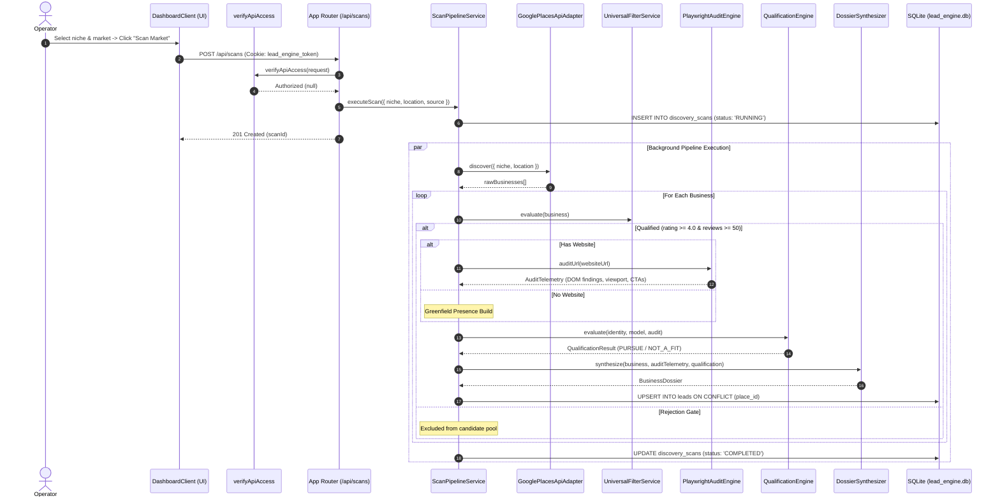

# ARCHITECTURE: Lead Engine (Workstation Model)
### Modular Feature-Driven (DDD) Subsystem Specifications

---

## 1. Directory & Subsystem Layout

```
src/
├── 🌐 app/                          # Next.js App Router (HTTP Controllers & Routing)
│   ├── api/
│   │   ├── auth/                    # login, logout, status (httpOnly session management)
│   │   ├── scans/route.ts           # POST (dispatch pipeline), GET (list scans), DELETE (scoped wipe)
│   │   ├── scans/[id]/route.ts      # GET (scan status & ranked leads), DELETE (individual scan)
│   │   ├── scans/[id]/cancel/       # POST (abort active execution)
│   │   ├── discovery/suggestions/   # GET (location-adaptive market presets)
│   │   ├── places/autocomplete/     # GET (Google Places autocomplete)
│   │   ├── leads/[id]/status/       # PATCH (triage state transition)
│   │   ├── leads/export/route.ts    # GET (sanitized CSV stream export)
│   │   └── audit/direct/route.ts    # POST (instant single URL teardown)
│   ├── globals.css                  # Dark obsidian HUD theme & translucent glass styles
│   ├── layout.tsx                   # Root layout & security header injection
│   └── page.tsx                     # React Server Component entrypoint
│
├── 🧠 features/                     # Core Business Domain Modules
│   ├── discovery/                   # Discovery Strategy & Provider Adapters
│   │   ├── types.ts                 # IDiscoveryAdapter interface
│   │   ├── GooglePlacesApiAdapter.ts# Primary Google Places API discovery
│   │   ├── LiveGoogleMapsAdapter.ts # Opt-in Chromium scraper (ALLOW_UNSAFE_MAPS_SCRAPE)
│   │   ├── SerpApiGoogleMapsAdapter.ts # Structured Google Maps REST API
│   │   ├── ApifyMapsAdapter.ts      # Apify Actor integration
│   │   └── MockDiscoveryAdapter.ts  # Zero-cost local fixture simulator
│   │
│   ├── auditor/                     # Headless Chromium DOM & UX Auditor
│   │   ├── types.ts                 # IAuditEngine interface
│   │   ├── PlaywrightAuditEngine.ts # Dual-viewport inspection & post-nav SSRF revalidation
│   │   └── mockServer.ts            # Embedded simulation server for integration tests
│   │
│   ├── qualification/               # Evidence-Driven Qualification & Relevance
│   │   ├── UniversalFilterService.ts # Rating >= 4.0, Reviews >= 50, Recency velocity
│   │   ├── ScoringEngine.ts         # Weighted heuristic: Reputation, Gap, Opportunity, Confidence
│   │   ├── CustomerJourneyDetector.ts # Empirical acquisition funnels (Sign-up, RFQ, Book, Visit, Call)
│   │   ├── OpportunityRelevanceEngine.ts # Business-model aware opportunity evaluation
│   │   ├── OpportunityClassifier.ts # Tier lookup table (WEBSITE, AUTOMATION, CUSTOM_SOFTWARE)
│   │   └── QualificationEngine.ts   # First-class lead disposition (PURSUE, NOT_A_FIT, INSUFFICIENT_EVIDENCE)
│   │
│   ├── commercial/                  # Market Context & Economic Profiling
│   │   ├── BusinessModelClassifier.ts # Maps 7 operating models (SaaS, Ecommerce, Industrial, Clinic, etc.)
│   │   └── CommercialEconomicsEngine.ts # Local market pricing bands & WBS scopes
│   │
│   ├── synthesis/                   # Sales Intelligence Formulation
│   │   ├── DossierSynthesizer.ts    # Model-aware pitch deck formulation
│   │   └── OutreachClaimValidator.ts# Grounded factual claim validation
│   │
│   └── pipeline/                    # Local Workstation Job Orchestration
│       └── ScanPipelineService.ts   # Upsert persistence on leads.place_id & cancellation handles
│
├── 🗄️ core/                         # Universal Workstation Foundation Layer
│   ├── auth/
│   │   └── verifyAccess.ts          # Fail-closed API guard & timing-safe comparison
│   ├── db/
│   │   ├── index.ts                 # SQLite on disk connection (WAL mode & busy timeouts)
│   │   └── schema.ts                # Drizzle ORM schema & TypeScript domain types
│   └── domain/
│       └── Guardrails.ts            # Runtime invariant assertion boundaries
│
└── 🎨 components/                   # Presentation Layer (React UI)
    ├── DashboardClient.tsx          # Real-time state manager, lock screen & scan polling
    ├── Header.tsx                   # Live workstation identity & stats
    ├── ScanLauncher.tsx             # Interactive launchpad & Direct URL audit mode
    ├── ExecutiveMetrics.tsx         # KPI telemetry summary strip
    ├── LeadMatrixTable.tsx          # Studio data grid with disposition & score rings
    ├── LeadInspectorDrawer.tsx      # Slide-over evidence inspector & outreach studio
    └── LivePipelineBanner.tsx       # Live scanning status & cancel trigger
```

---

## 2. Data Flow & Processing Lifecycle


